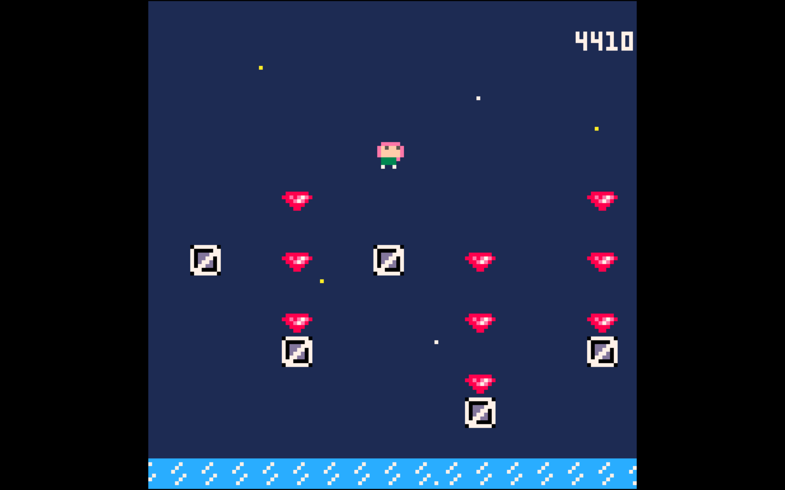

# MOMO
<i>Momo was separated from her friends while exploring the caves of Mount Kioji – help her find a way back to the surface while collecting gems, dodging slimes, and avoiding icy pitfalls.</i>
 
 

 
 
Momo is a 2D platformer developed with the Pico-8 game engine.

This project was born mostly as an excuse to learn some basic game development concepts and put them into practice. All the code, art, sound, and music was written and made in the mighty little Pico-8 editor.

This repository contains the final, playable game, as well as the game's source code. The code is written in Lua, and should be easy to poke around in and modify if you have a copy of Pico-8.

To play the game, simply download this repository and open <i>index.html</i> in a web browser.

 
 

 
 

 
 
